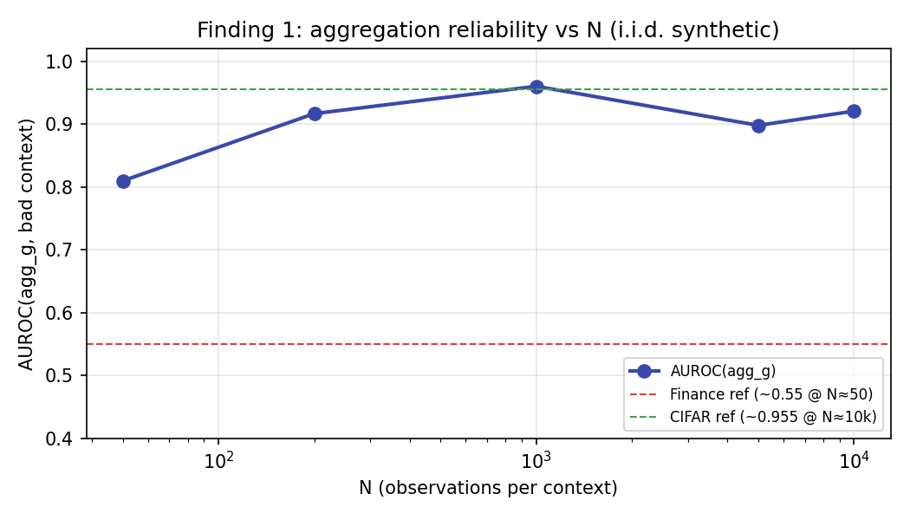

# Benchmarks

Reproducible uncertainty-quality comparisons for `deup`. All scripts use **seed=42**
and write JSON tables under `benchmarks/results/`.

## Quick run

```bash
pip install -e ".[dev,benchmark,gbm,finance]" pyarrow
python benchmarks/run_all.py
```

See the full write-up in [BENCHMARKS.md](https://github.com/ursinasanderink/deup/blob/main/BENCHMARKS.md)
in the repository root (tables are committed from the last benchmark run).

---

## Tabular regression (California housing)

| Method | Spearman ρ | Notes |
|---|---:|---|
| **DEUP** | **0.509** | `DEUPRegressor` + RF |
| **DEUP + LightGBM** | 0.444 | `TabularDEUP(backend="lgbm")` |
| **DEUP + XGBoost** | 0.400 | `TabularDEUP(backend="xgb")` |
| **DEUP + CatBoost** | 0.407 | `TabularDEUP(backend="catboost")` |
| Ensemble disagreement | 0.460 | Bootstrap variance |
| Conformal residual | 0.447 | Cal-set \|residual\| model |
| Laplace (BayesianRidge) | 0.015 | Posterior variance |

---

## N-sweep — aggregation reliability (headline)



**i.i.d. contexts:** AUROC(agg_g) rises to **≈0.96** at N≈1,000–10,000 (literature
reference on CIFAR-10-C batches: ≈**0.955**).

**Low-N autocorrelated:** AUROC(agg_g)≈**0.43** (cross-sectional finance reference ≈0.55);
**HealthIndex** recovers to AUROC≈**1.0** on the synthetic proxy (≈**0.75** on a real
finance holdout in published evaluation).

Details: [Aggregation reliability](reliability.md).

---

## CIFAR & finance

- **CIFAR proxy:** oracle agg-g AUROC **1.0** on high-N i.i.d. batch simulation
  (literature reference **0.955** on CIFAR-10-C)
- **Finance walk-forward:** ρ(g, rank_loss)=**0.25** DEV / **0.17** FINAL on a
  cross-sectional ranker panel; see `benchmarks/run_finance_walkforward.py`

---

## Future work

torchvision ResNet-18 → `VisionDEUP`; HuggingFace encoders; PyTorch Lightning hooks — see
the project roadmap.
