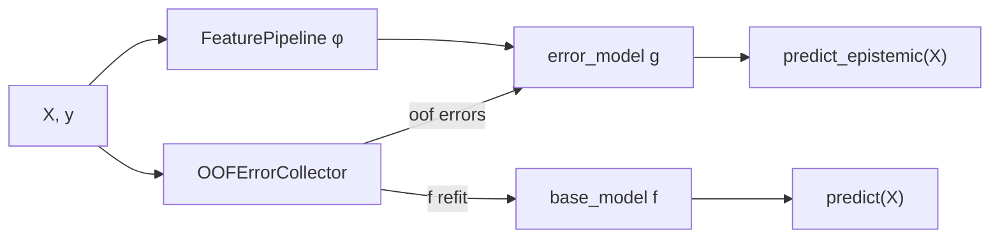

# Theory & mathematics

This page summarizes the DEUP framework as defined by Lahlou *et al.* (2023,
[TMLR](https://arxiv.org/abs/2102.08501)) and the risk decomposition used in this
library. The implementation follows **Algorithm 2** (K-fold pre-fill of the error
dataset) for honest out-of-sample error targets.

## Risk decomposition

For input $x \in \mathcal{X}$, target $y \in \mathcal{Y}$, loss $\ell$, and predictor
$f$, the **pointwise risk** is

$$
R(f, x) = \mathbb{E}_{P(Y \mid X=x)}\bigl[\ell(Y, f(x))\bigr].
$$

The **Bayes predictor** $f^*(x) = \arg\min_a \mathbb{E}[\ell(Y, a) \mid X=x]$ achieves
the irreducible **aleatoric** floor

$$
A(x) = R(f^*, x).
$$

The **excess risk** (epistemic uncertainty under this framework) is

$$
\mathrm{ER}(f, x) = R(f, x) - A(x).
$$

Under squared error with Gaussian $P(Y \mid X=x) = \mathcal{N}(\mu(x), \sigma^2(x))$:

$$
R(f,x) = \sigma^2(x) + (f(x)-\mu(x))^2, \qquad
\mathrm{ER}(f,x) = (f(x)-\mu(x))^2.
$$

Under log loss for $K$-class classification with $\mu(x) \in \Delta^K$:

$$
R(f,x) = H(\mu(x), f(x)), \qquad
\mathrm{ER}(f,x) = D_{\mathrm{KL}}(\mu(x) \,\|\, f(x)).
$$

Unlike posterior-variance estimators, excess risk captures **model misspecification**
(bias): when $f^* \notin \mathcal{H}$, disagreement among approximate Bayesian
predictors can shrink even as the model remains systematically wrong.

## DEUP estimator

DEUP trains a secondary **error predictor** $e$ (the `error_model`, written $g$ in
this library's code) to estimate the generalization error $R(f, x)$, then subtracts
an aleatoric estimate $a(x)$. The paper's estimator (Eq. 9) is

$$
u(f, x) = e(f, x) - a(x),
$$

an estimator of the excess risk $\mathrm{ER}(f, x)$. Since epistemic uncertainty is
non-negative, `deup` reports the **clipped** form

$$
\hat{e}(x) = \max\bigl(0,\; g(x) - a(x)\bigr),
$$

which coincides with $u(f,x)$ wherever the latter is non-negative.

| Symbol | Role in `deup` | v0.1 default |
|---|---|---|
| $f$ | `base_model` | any sklearn regressor |
| $g \equiv e$ | `error_model` | HistGradientBoostingRegressor |
| $a(x)$ | aleatoric floor | **0** (conservative proxy: $g(x)$ alone) |
| $\ell$ | `loss` | `"squared"` (per-row error target) |

### Estimating the aleatoric floor $a(x)$

The paper (Sec. 3) gives three scenarios, each implemented or planned in `deup`:

1. **Noiseless** ($A(x) = 0$): set $a(x) = 0$, so $\hat{e}(x) = g(x)$. This is the
   **v0.1 default** and the paper's choice for its noiseless experiments.
2. **Replicate oracle** (regression, squared loss): with $K$ i.i.d. outcomes
   $y_1,\dots,y_K \sim P(Y\mid x)$, the unbiased aleatoric target is
   $\tfrac{K}{K-1}\widehat{\mathrm{Var}}(y_1,\dots,y_K)$; fit $a$ on these. Implemented
   as `Heteroscedastic` / `Quantile` aleatoric estimators (P6).
3. **No estimate available**: use $e(f,x)$ itself as a **conservative (pessimistic)
   proxy** for epistemic uncertainty, i.e. $a(x)=0$. Valid when uncertainty is only
   used to *rank* points and aleatoric noise is roughly constant across $\mathcal{X}$.

Setting $a(x)\equiv 0$ (scenarios 1 and 3) is what v0.1 ships. The aleatoric
estimators of scenario 2 and the $\hat{e}=\max(0,g-a)$ decomposition land in v0.2
(Prompt P6).

## Algorithm 1 — fixed training set

Given trained $f$, validation set $\{(x_i', y_i')\}$, and aleatoric estimator $a$:

1. Build $\mathcal{D}_e = \{(x_i', \ell(y_i', f(x_i'))\}_{i=1}^K$.
2. Fit $g$ on $\mathcal{D}_e$ (regress errors; often with $\log(\text{error} + \varepsilon)$
   target stabilization).
3. Return $\hat{u}(x) = g(x) - a(x)$.

**Critical:** errors must be **out-of-sample** for $f$. Using in-sample residuals
underestimates uncertainty (Sec. 3.2).

## Algorithm 2 — K-fold pre-fill (what `OOFErrorCollector` implements)

When no held-out set exists, pre-fill $\mathcal{D}_e$ via cross-validation:

1. For each fold $k$: clone $f$, fit on train indices, predict held-out indices.
2. Store out-of-fold prediction $\hat{y}_i$ and error $\ell(y_i, \hat{y}_i)$.
3. Optionally refit $f$ on **all** data for deployment (`refit_on_all=True`).

Each row receives exactly one out-of-sample error — the target for $g$. Rows never
held out (e.g. earliest walk-forward window) are excluded.

### Refit assumption

With `refit_on_all=True`, $g$ learns errors of fold models $f_{-k}$ (strict subsets)
but is paired at inference with full-data $f$. This standard stacking assumption means
$g$ describes a *slightly smaller* model; the gap is small for reasonable fold counts.

## Stationarizing features $\phi_{z^N}(x)$

In interactive settings the error target is non-stationary as $f$ is retrained. The
paper embeds $(x, z^N)$ into **stationarizing features** (Sec. 3.2, Eq. 12):

$$
\phi_{z^N}(x) = \bigl(x,\; s,\; \log \hat{q}(x \mid z^N),\; \log \hat{V}(\tilde{\mathcal{L}}, z^N, x)\bigr)
$$

| Feature | Builder in `deup` | Meaning |
|---|---|---|
| $x$ | `RawFeatures` | raw inputs |
| $s$ | `SeenBit` | 1 if $x$ was in training set $z^N$, else 0 |
| $\log \hat{q}$ | `DensityFeature` | log-density under training distribution |
| $\log \hat{V}$ | `VarianceFeature` | log predictive variance (ensemble / GP) |
| distance | `DistanceToTrain` | $k$-th NN distance to training manifold |
| \|residual\| proxy | `ResidualMagnitude` | kNN-smoothed training residual magnitude |

**Mahalanobis / diagonal Gaussian density** (Appendix C; Lee *et al.* 2018 OOD
baseline). With per-dimension MLE $\mu_d$, $\sigma^2_d$ (clamped $\geq 10^{-6}$):

$$
\log \hat{q}(x) = -\tfrac{1}{2}\sum_d \left[\frac{(x_d-\mu_d)^2}{\sigma^2_d} + \log\sigma^2_d\right] - \tfrac{D}{2}\log(2\pi).
$$

`DensityFeature(method="mahalanobis")` implements this closed-form estimator.

!!! note "Finding 3 — density can be null"
    In homogeneous tabular/finance universes, density features may add **no signal**
    beyond rank geometry. Treat density as **optional and ablatable**; rank-geometry
    residualization (P6) is required for cross-sectional rankers.

## Mapping to library objects

## Ranking adaptation & two-level deployment

`deup`'s ranking support (`DEUPRanker`, rank loss, rank-geometry residualization)
extends DEUP from regression/classification to **cross-sectional ranking** by
predicting *rank displacement* and defining an epistemic signal $\hat{e}$ relative to
a point-in-time (PIT-safe) baseline. Two empirical findings motivate the library design:

- **Rank-geometry coupling.** $\hat{e}$ is structurally coupled with signal strength
  (median per-date correlation between $\hat{e}$ and $|\text{score}|$ ≈ 0.6), so naive
  inverse-uncertainty sizing de-levers the strongest signals. This motivates the
  optional rank-geometry residualization in
  [`RankResidualizer`](decomposition.md).
- **Two-level deployment.** Uncertainty is best used as (i) a strategy-level
  regime-trust gate deciding *whether to trade* and (ii) a position-level **tail-risk
  cap** — i.e. DEUP adds value mainly as a tail-risk guard rather than a continuous
  sizing denominator. This informs the aggregation-reliability diagnostics.

## References

- Lahlou, Jain, Nekoei, Butoi, Bertin, Rector-Brooks, Korablyov, Bengio (2023).
  *DEUP: Direct Epistemic Uncertainty Prediction.* TMLR.
  [arXiv:2102.08501](https://arxiv.org/abs/2102.08501)
- Cross-sectional ranking / aggregation reliability (optional finance background):
  [arXiv:2603.13252](https://arxiv.org/abs/2603.13252)
- Kotelevskii *et al.* (2025a). Bregman-divergence excess risk (formal cover for DEUP).
- Lee *et al.* (2018). Mahalanobis OOD score (diagonal Gaussian special case).
- Hüllermeier & Waegeman (2019). Aleatoric vs epistemic uncertainty survey.
- Romano, Patterson, Candès (2019). *Conformalized Quantile Regression.* NeurIPS.
- Lei *et al.* (2018). *Distribution-Free Predictive Inference for Regression.* JASA.
